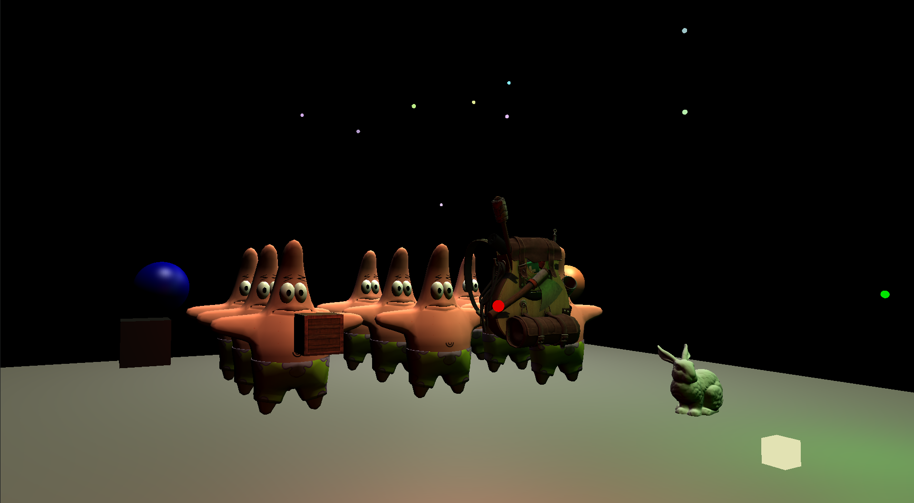
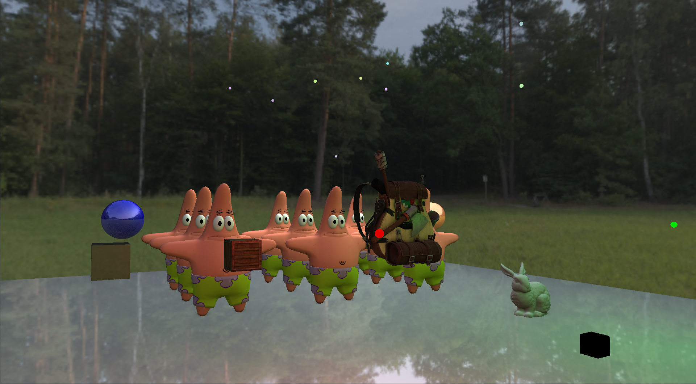

# Advanced Graphics Engine
[GitHub Repository](https://github.com/yeraytm/Advanced-Graphics-Engine) - [Latest Release](https://github.com/yeraytm/Advanced-Graphics-Engine/releases)

Its contributors are:
- [Yeray Tarifa](https://github.com/yeraytm)
- [Sergi Colomer](https://github.com/Lladruc37)

## Engine Features
- Static 3d model loading
- Embedded Geometry (Primitives): Plane, Sphere & Cube
- Light Casters: Point & Directional Lights
- Free camera roaming or Pivot Camera (around the center of the scene)
- ImGui

## Renderer Features
- Forward or Deferred Mode
- Environment Mapping: Skybox & Irradiance

### Deferred Specific Features
- G-Buffer (Framebuffer Object) with different render targets attached: Position, Normals, Albedo, Specular, Reflective & Depth
- Render to screen-filling quad
- Geometry & Lighting Pass
- Light caster entities are rendered using forward shading
- Screen-Space Ambien Occlusion (SSAO)

## Controls

| Action | Input |
| :---: | :---: |
| **Forwards** | W |
| **Backwards** | S |
| **Left** | A |
| **Right** | D |
| **Up** | Q |
| **Down** | E |
| **Rotation** | MOUSE LEFT |
| **Zoom** | MOUSE WHEEL |
| **Quit** | ESC |

## ImGui Windows
### Renderer
Change between Forward and Deferred Rendering through a combo box.

#### Environment Mapping
Enable or disable the following environment mapping options:
- Skybox
- Irradiance
- Reflection
- Refraction

#### SSAO
`It is of note that these options can only be displayed in Deferred Rendering`

Enable or disable the SSAO effect and the following SSAO options and variables:
| SSAO Option | Description |
| :---: | :---: |
| **Range check** | Avoid incorrect contribution near edges to the occlusion factor |
| **Blur** | Smooth the effect for a better result |
| **Radius** | The radius of the hemisphere |
| **Bias** | To solve acne effect when reconstructing the depth position |
| **Power** | Multiplier of the effect |
| **Kernel Size** | The amount of random samples |
| **Noise Size Scale** | The amount of semi-random rotations |

#### G-Buffer Render Target
`It is of note that these options can only be displayed in Deferred Rendering`

Select the render target that will be displayed in screen through a combo box. The following are it's options:
- Final Color
- Depth
- Position
- Normal
- Albedo
- Specular
- Reflective + Shininess

### Scene
#### Camera
Here the user can modify the camera's parameters of position, speed and zoom.
In addition, the user can switch from free camera (the controls have been explained above) and pivot camera (where the camera pivots around the center of the scene).
If the camera is in pivot mode, the user can also modify it's radius from the center and if it auto rotates (and at which speed) or not (the user can rotate around the pivot with _MOUSE LEFT_ similarly to the free camera).

#### Lights
Here the user can change the color of the directional light and of all point lights.
Additionally, there is a button to turn off all point lights which sets their color to black thus giving no light.

### OpenGL
Here the user can see all the information about the current version of OpenGL & GLSL and GPU information. Moreover, a list of all available extension of OpenGL.

### Performance
Ccheck the current framerate (FPS), frametime (in seconds), render loop time (in milliseconds) and time since startup (in seconds).
